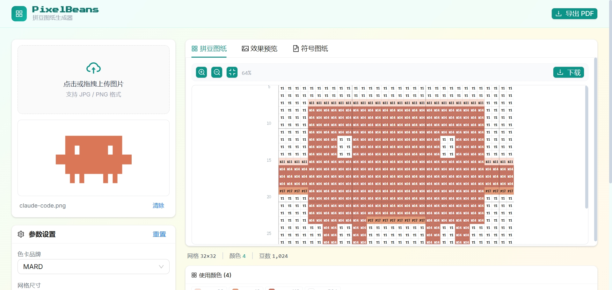

# PixelBeans

将照片转化为专业拼豆（Perler/Hama）图纸的工具。最终形态是提供给 App 开发者调用的算法能力（后端 HTTP API / 端侧算法包）。

## 快速开始

### 环境要求

- Python 3.12+（Conda env `image`）
- Node.js 18+

```bash
conda activate image
pip install -e .
```

### 命令行使用

```bash
python cli.py --input images/anime.jpg --size 58x58 --out results/anime
```

参数说明：

- `--input` 输入图片路径（JPG/PNG）
- `--size` 目标网格尺寸，格式 `宽x高`（如 `58x58`）
- `--out` 输出目录
- `--palette` 色卡品牌（默认 `mard`）
- `--max-colors` 最大颜色数限制

### Web 演示（M2）

启动后端：

```bash
conda activate image
uvicorn server.main:app --host 0.0.0.0 --port 8000
```

启动前端：

```bash
cd web && npm install && npm run dev
```

浏览器打开 `http://localhost:5173`

效果展示 


## 核心特性

- **CIE LAB + ΔE2000** 色彩量化，贴合人眼感知
- **MARD 291 色** 国产色卡支持
- **孤豆清理** 连通域分析自动合并孤立色豆
- **SVG 矢量渲染** 图纸任意缩放不失真，行列编号辅助定位
- **结构化输出** JSON 图纸数据 + 预览 PNG + 符号图纸 + BOM 清单

## 项目结构

```
PixelBeans/
├── pixelbeans/       算法核心（palette, pipeline, color_science, export）
├── palettes/         色卡数据（mard.json）
├── server/           FastAPI 本地开发层
├── web/              React + Vite + Ant Design 前端
├── api/              线上部署层
├── tests/            单元测试
├── docs/             实施方案和 PRD
├── images/           样例图
└── cli.py            命令行入口
```

## 技术栈


| 层面   | 技术                                              |
| ---- | ----------------------------------------------- |
| 算法   | Python, numpy, Pillow, opencv                   |
| API  | FastAPI, Pydantic, uvicorn                      |
| 前端   | React 18, Vite, Ant Design 5, Tailwind CSS, SVG |
| 测试   | pytest                                          |
| Lint | ruff                                            |


## 色卡

首发 MARD 291 色，覆盖色相环 360 度无死角。已知 Q4/R11 共用同一 hex（#FFEBFA），算法内部已处理 alias 归并。

## 许可证

MIT